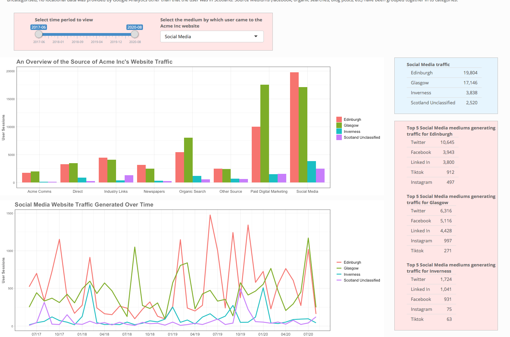
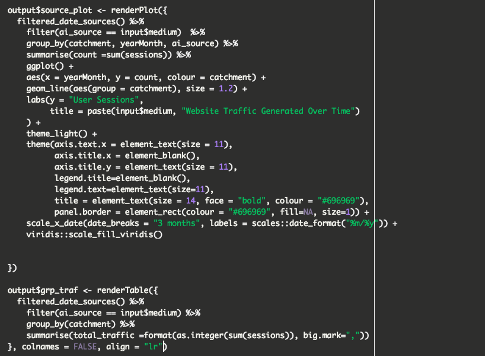
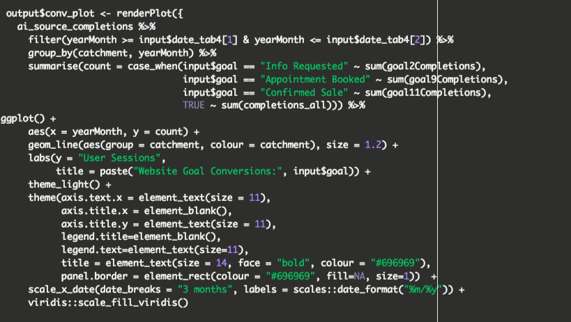

# acme_inc_shiny_app

## Code Clan Group Data Project

#### A CodeClan project, working within a team on a real life data project.

Our project “client” told us that Google Analytics was restrictive in how it allowed them to analyse their company’s website performance in each of it’s 3 catchment cities.  We were given the brief to extract the data we deemed necessary from the client’s Google Analytics platform and to perform analysis and insight.

#### Process ( Over the course of 4 days)
1. i) We started by meeting as a team to discuss the key areas for focus and to roughly plan a visualisation of how our app would look (we decided a Shiny App was how we would like to visualise the data).  This all had to be done remotely via Zoom meetings.
1. ii) We agreed responsibilities and expectations for each team member.
1. iii) We worked together to perform the API calls, to extract the data from Google Analytics and to perform basic data wrangling,  data synthesisation from which we could all work from individually and to create the skeleton structure of our Shiny App.
1. iv) We then worked individually on our areas but maintaining contact at all times to maintain a consistency in each of our areas (tabs).
1. v) We used Git branching throughout the project and worked closely to resolve conflicts
1. vi) We met again to plan how we would present our app to the client.  We finally met with the client to present the Shiny App and which the client welcomed the insights provided and responded most positively.

#### My part in the project
In addition to the extracting of the data I  took the lead in the wrangling and synthesisation of the data,  designing the technical structure of the Shiny App, the design (customised CSS) and content of tab 3 (I also contributed to the programming and styling of tabs 2 and 4.

#### Tech Used
The project was carried out using R to create a Shiny App.
I personally performed  R programming utilising cbind(), sin(), sample(), grepl(), str_detect(), ifelse(), case_when(), many aspects of dplyr and customisation of ggplot2.

_Personal code example 1_

_Personal code example 2_
